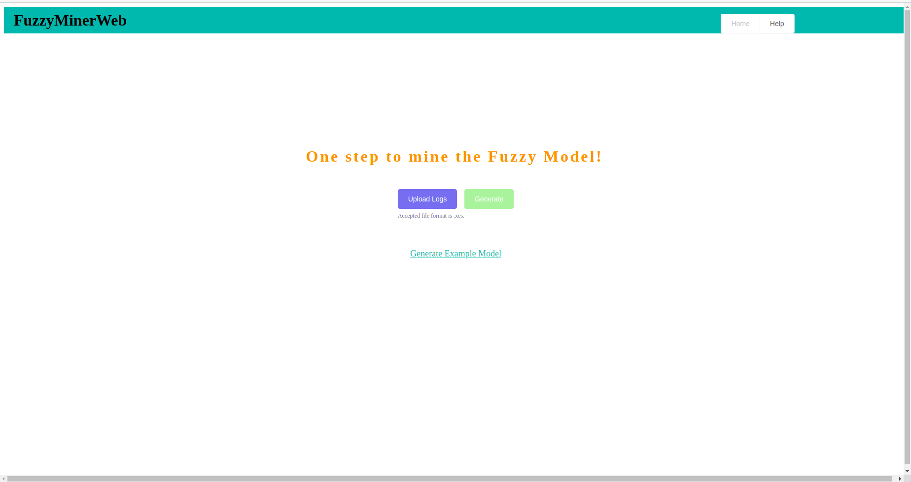
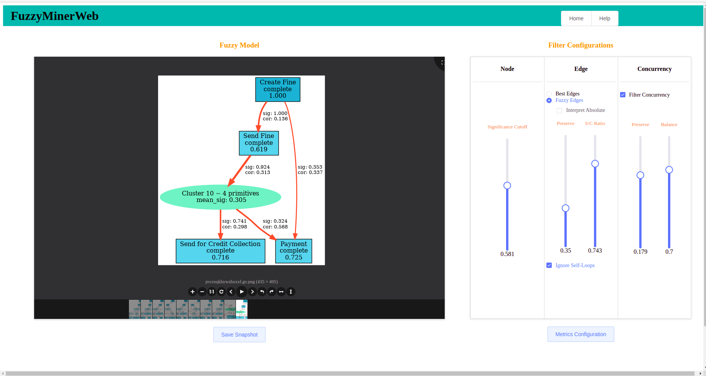

<h1 align="center">Fuzzy Miner</h1>
<div align="center">
  <strong>A fuzzy miner web application by which you can generate process models as per your requirements. Import a <a href="http://xes-standard.org/" target="_blank">XES</a> log file and just wait for the miner to generate the process model. The metrics and the filters are at your disposal and can be modified as per your requirements. The project is based on this <a href="https://www.researchgate.net/publication/221586306_Fuzzy_Mining_-_Adaptive_Process_Simplification_Based_on_Multi-perspective_Metrics" target="_blank">paper</a>. </strong>
</div>
<div align="center">
  
  [](http://forthebadge.com)
  <br>
  <!-- Stability -->
  <a href="https://nodejs.org/api/documentation.html#documentation_stability_index">
    
  </a>
  <a href="https://github.com/fnc11/FuzzyMiner/issues"></a>
  <!-- Standard -->
  <a href="https://standardjs.com">
    
  </a>
  
  
  
</div>

<div align="center">


<br><br>


</div>

## Table of Contents
1. [Features](#features)
2. [Technology used](#technology-used)
3. [Installation requirements](#installation-requirements)
    - [Windows](#windows)
    - [MacOS](#macos)
    - [Linux](#linux)
4. [How to use](#how-to-use)
5. [Contributors](#contributors)
6. [Credits](#credits)
7. [Reference](#reference)
8. [License](#license)

## Features

[(Back to top)](#table-of-contents)

- __Easy to use:__ our package makes it easy for generating process models for unstructured data
- __User friendly UI:__ clean and simple UI
- __Fast:__ Can handle large log files. Well in case of too large, you need to wait a bit!

## Technology used

[(Back to top)](#table-of-contents)

<b>Built with</b>
- [Python](https://www.python.org/)
- [Django](https://www.djangoproject.com/)
- [Vue JS](https://vuejs.org/)
- [Element](https://element.eleme.io/#/en-US)

<b>Tested with</b>
- [PyUnit](https://docs.python.org/2/library/unittest.html)

## Installation requirements

[(Back to top)](#table-of-contents)

### Windows
1. Install Python from [here](https://www.python.org/). <br> <br>
Four Python 3.6 installers are available for download - two each for the 32-bit and 64-bit versions of the interpreter. The web installer is a small initial download, and it will automatically download the required components as necessary.<br>
After starting the installer, one of two options may be selected:<br>
<b>If you select “Install Now”:</b>
- You will not need to be an administrator (unless a system update for the C Runtime Library is required or you install the [Python Launcher](https://docs.python.org/3.6/using/windows.html#launcher) for Windows for all users)
- Python will be installed into your user directory
- The [Python Launcher](https://docs.python.org/3.6/using/windows.html#launcher) for Windows will be installed according to the option at the bottom of the first page
- The standard library, test suite, launcher and pip will be installed
- If selected, the install directory will be added to your `PATH`
- Shortcuts will only be visible for the current user<br><br>
<b>Selecting “Customize installation” will allow you to select the features to install, the installation location and other options or post-install actions. To install debugging symbols or binaries, you will need to use this option.</b><br><br>
- To perform an all-users installation, you should select “Customize installation”. In this case:
- You may be required to provide administrative credentials or approval
- Python will be installed into the Program Files directory
- The Python Launcher for Windows will be installed into the Windows directory
- Optional features may be selected during installation
- The standard library can be pre-compiled to bytecode
- If selected, the install directory will be added to the system PATH
- Shortcuts are available for all users
<br>

2. Install Node.js from [here](https://nodejs.org/en/download/). <br> <br>
The node package manager (npm) will also be installed with NodeJS and is required for project.<br>

3. Install virtualenv
```
pip install virtualenv
```

### MacOS
1. Install homebrew
```
ruby -e "$(curl -fsSL https://raw.github.com/mxcl/homebrew/go)"
```
2. Install python
```
brew install python
```
3. Install pip
```
curl -O http://python-distribute.org/distribute_setup.py
python distribute_setup.py
curl -O https://raw.github.com/pypa/pip/master/contrib/get-pip.py
python get-pip.py
```
4. Install virtualenv
```
pip install virtualenv
```
5. Install nodejs and npm
```
brew update
brew install node
```

### Linux
1. Python3 comes preinstalled in Ubuntu 18.04 and 20.04 so no need to separately do anything, however you may need to update it, for that follow below commands:
```
sudo apt update
sudo apt -y upgrade
```
2. To install virtualenv pacakge do the following:
```
sudo apt-get install python3-venv
```
3. Install nodejs related packages.
```
sudo apt-get install nodejs
sudo apt-get install npm
```
(If there are errors install this first ```sudo apt-get install nodejs-dev node-gyp libssl1.0-dev``` and then retry installing npm.)

## Running the project

[(Back to top)](#table-of-contents)

1. Clone the repository:
```
git clone URL
```
2. Create a virtual environment inside the package FuzzyMiner
```
virtualenv mypython
```
In case of Ubuntu/Linux use the following command to create virtual environment:
```
python3 -m venv mypython
```
3. Activate the virtual environment
#### Windows command
```
mypthon\Scripts\activate
```
#### MacOS/Linux command
```
source mypython/bin/activate
````
4. Assuming you have virtual environment inside the project, activate it and install necessary softwares by running following command.
```
pip install -r requirements.txt 
```
If you come across any error while installing a library, you need to install or upgrade Microsoft C++ Build Tools. To do that please head over to [here](https://visualstudio.microsoft.com/visual-cpp-build-tools/). <br>

5. Go to `/miner-web` folder and run the following
```
npm install
npm run build
```
6. Change `FuzzyMiner/FuzzyMiner/settings.py.example` to `settings.py`
7. Run the script `secret.py`
```
python3 secret.py
```
8. Copy the displayed key in previous step and paste it in as value for `SECRET_KEY` variable in the `settings.py` file
9. Run the following command after navigating to `FuzzyMiner/FuzzyMiner`
```
python3 manage.py runserver
```
## How to use?

[(Back to top)](#table-of-contents)

Please refer to the <b>Help</b> page of the web application when you run it.

## Contributors

[(Back to top)](#table-of-contents)

Built with ❤ by:

* [Praveen Yadav](https://github.com/fnc11) 
* [Pruthvi Hegde](https://github.com/pruthvi11) 
* [Prantik Chatterjee](https://github.com/Prantikc22)
* [Iftekhar Ahmed](https://github.com/iftekhar-ahmed)
* [Yongzhao Li](https://github.com/Pireirik) 


## Reference

[(Back to top)](#table-of-contents)

* [PADS Chair of RWTH Aachen University](https://www.pads.rwth-aachen.de/go/id/pnbx/?lidx=1)
* This project is based on [Business Process Management: 5th International Conference, BPM 2007, Brisbane, Australia, September 24-28, 2007. Proceedings](https://www.researchgate.net/publication/221586306_Fuzzy_Mining_-_Adaptive_Process_Simplification_Based_on_Multi-perspective_Metrics)

## License

[(Back to top)](#table-of-contents)

The Fuzzy Miner Web Application is released under the under terms of the [Apache License V2.0](LICENSE).
